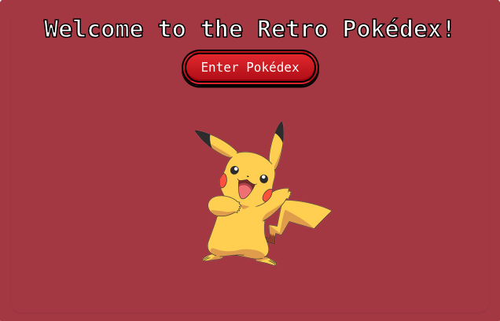
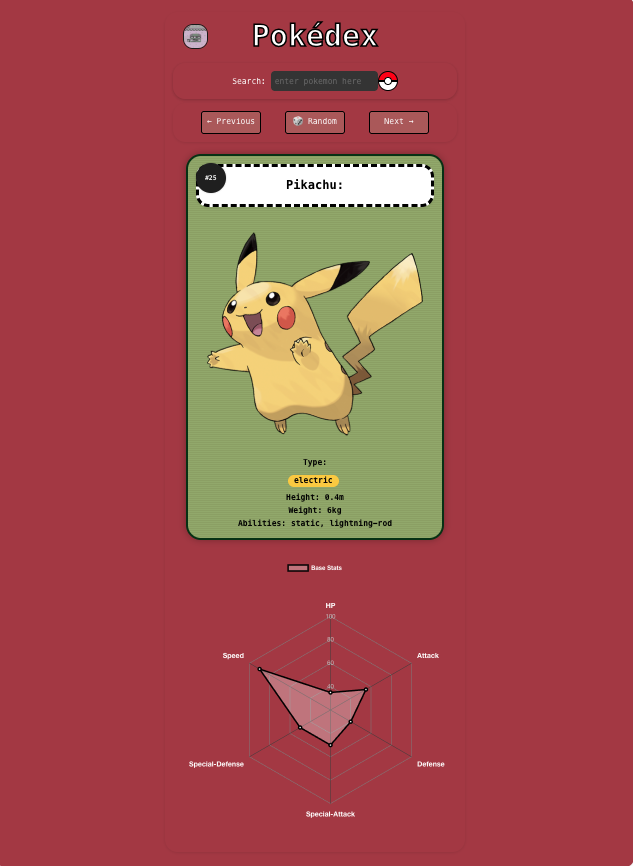

# The Retro Pokédex

A nostalgic React-based app that emulates the classic Pokemon player experience of exploring a Pokedex - styled in a manner that is reminiscent of an old-school Game Boy interface.

<table>
  <tr>
    <td align="center">
      <a href="./public/pokedex-landingpage-screenshot.png">
        
      </a>
    </td>
    <td align="center">
      <a href="./public/pokedex-screenshot.png">
        
      </a>
    </td>
  </tr>
</table>

---

## 📦 Features

- 🔍 **Search Pokémon** by name or ID
- 🎲 **Random**, **Next**, and **Previous** Pokémon navigation
- 🧭 **URL-based navigation** with scroll position memory
- 🎨 Game Boy–style **pixel art UI** with animated Pokéball
- 🏠 Custom landing page with **hover-activated retro Pikachu**
- 🔁 Custom hover transitions and tooltips
- 🧪 Error handling for invalid searches and missing data

<br>

---

## 🚀 Getting Started

### 1. Clone the repository:

```bash
git clone https://github.com/your-username/retro-pokedex.git
cd retro-pokedex
```

<br>

### 2. Clone the repository:

```bash
npm install
```

<br>

### 3. Run the development server:

```bash
npm run dev
```

> Open http://localhost:5173 to view it in your browser.

<br>

## 🛠️ Tech Stack:

    •	React.js – Frontend framework
    •	React Router – For routing between pages and dynamic Pokémon views
    •	Chart.js + react-chartjs-2 – For stat visualisation
    •	Axios – For fetching data from the PokéAPI
    •	Vite – Lightning-fast build tool
    •	Custom CSS – For Game Boy–inspired UI and animations
